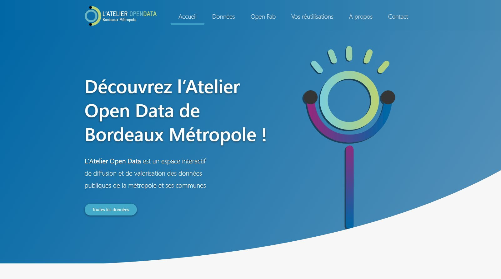
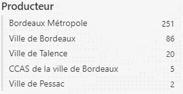
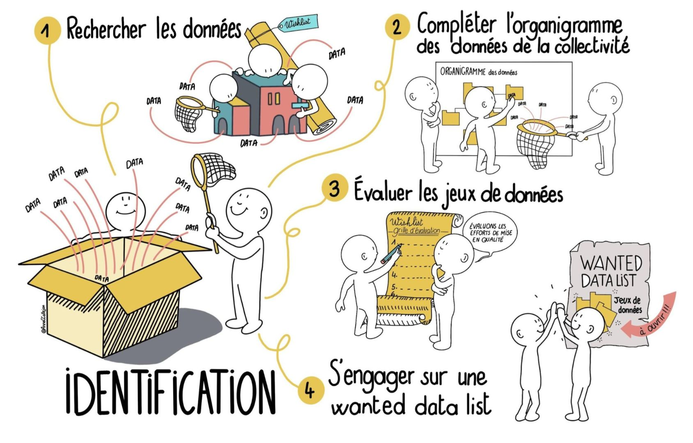
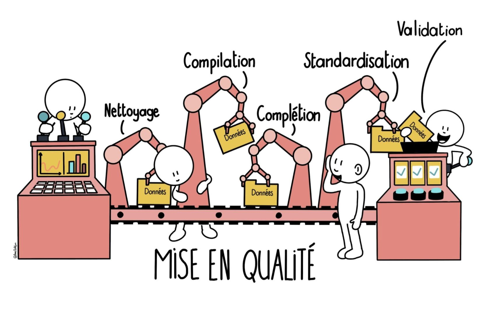
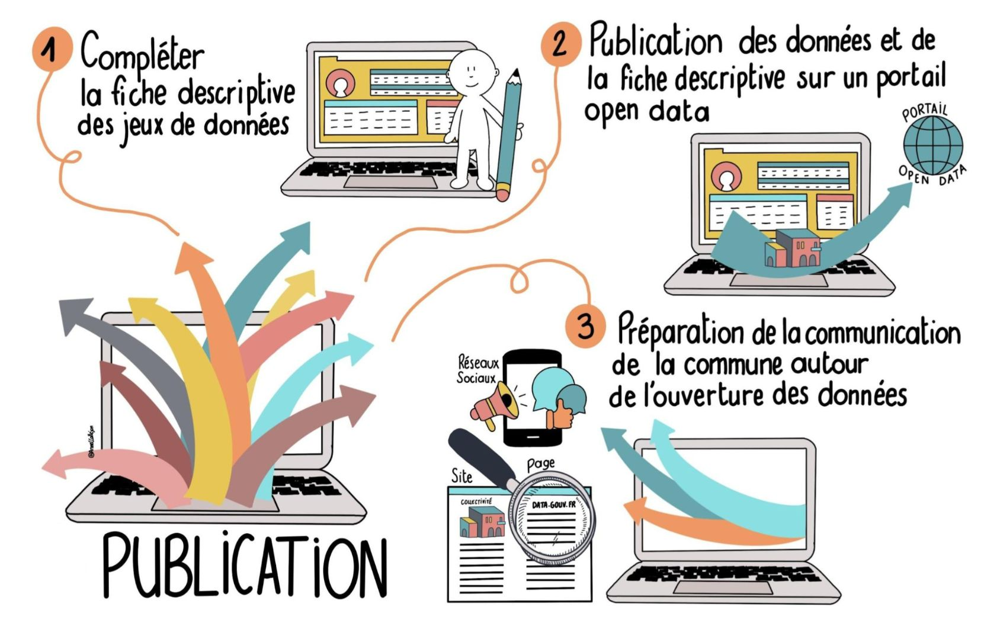
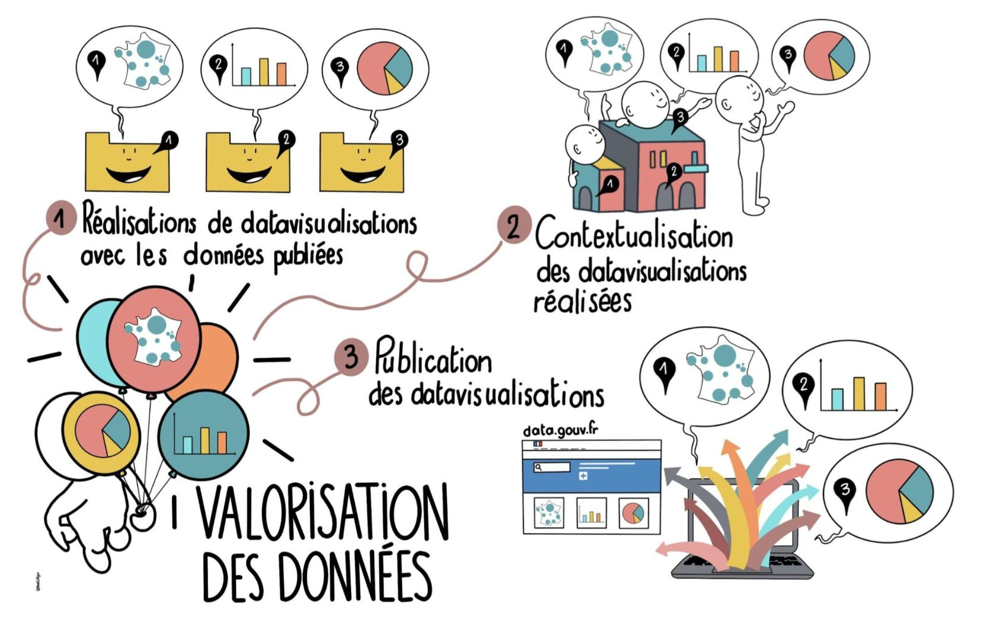
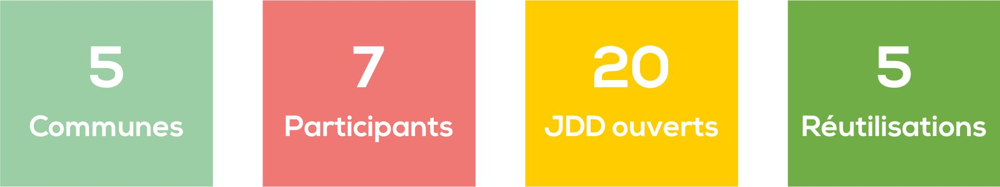
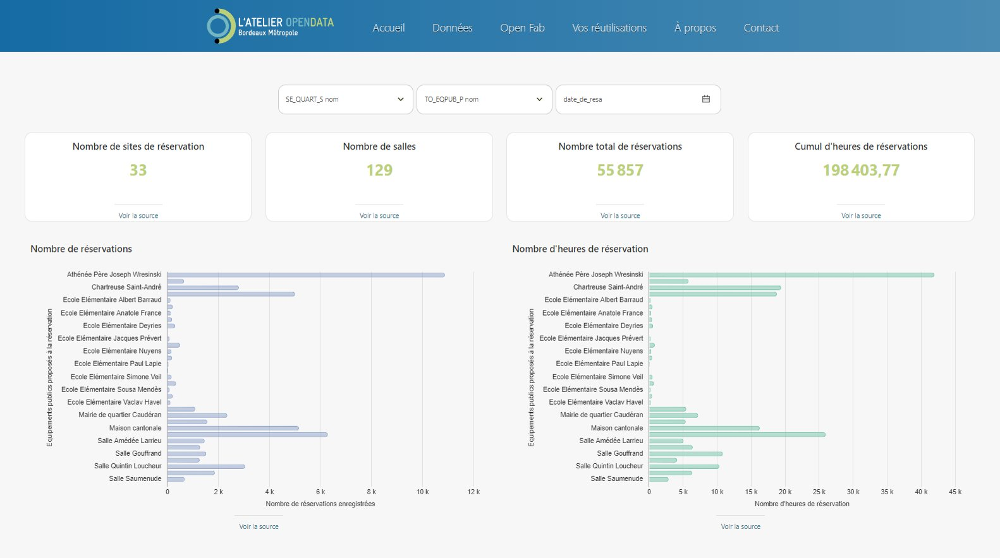
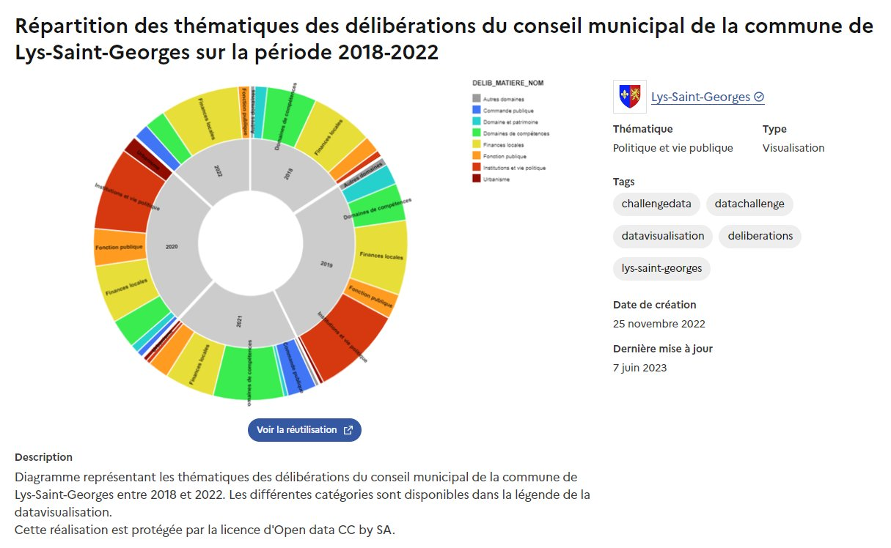

```{css, echo = FALSE}
#TOC ul>li {
  color: white;
  background-color: #23ae84;
  font-weight: normal; /*gras*/
  padding: 8px; /*espace avant*/
  /*margin-top: 1px; /*espace avant*/
}
#TOC {
  max-width: fit-content;
  white-space: nowrap;
  font-size: 1.3em; /*taille*/
  margin-left: -1%;
  z-index: 2; /*met la TOC au premier plan devant marginnote*/
  font-family: "Nexa Bold"; /*police*/
}
.sidenote, .marginnote { 
  float: left;
  clear: left;
  margin-left: -27%;
  margin-right: -40%;
  width: 57%;         # best between 50% and 60%
  margin-top: 0;
  margin-bottom: 0;
  font-size: 1.1rem;
  line-height: 1.3;
  vertical-align: baseline;
  position: relative;
}
```

```{r logo et police, echo = FALSE, message = FALSE, warning=FALSE, error=FALSE}
# Logo BDM haut de page
htmltools::img(src = "https://nextcloud.datactivist.coop/s/kWMDDLHBXHXXgSE/preview", 
               alt = 'logo', 
               style = 'position:absolute; top:0; left:0; right:0;')

# Polices Nexa et Trade Gothic
library(showtext)
font_add("Nexa", regular = "Nexa Bold.otf")
font_add("Trade Gothic", regular = "Trade Gothic.otf")
showtext_auto()
```


<div class="sidenote">{width=200px}</div>


## Introduction

Territoires pionniers en France de l’open data, Bordeaux Métropole et la ville de Bordeaux œuvrent activement depuis le début des années 2010 à l’ouverture et la réutilisation des données publiques dont elles ont la responsabilité. 
Dès 2011, la Communauté Urbaine de Bordeaux et la ville de Bordeaux inaugurent les premiers portails de données ouvertes du territoire. 
En 2019, les deux administrations font converger leurs outils et créent, avec l’aide de cinq communes métropolitaines pilotes (Bègles, Mérignac, Le Taillan-Médoc, Pessac et Talence), “[l’atelier open data](https://opendata.bordeaux-metropole.fr/pages/accueil/)” : une plateforme de données ouvertes mutualisée. 



La mise à disposition de la plateforme s’accompagne d’une offre de service open data opérée par la Direction Générale Numérique et Systèmes d’Information (DGNSI), service commun de Bordeaux Métropole et des communes ayant mutualisé leur système d'information. 
En janvier 2023, l’atelier open data compte plus de 360 jeux de données accessibles et a permis la création d’une dizaine d’applications et de services par l’administration ou des tiers réutilisateurs.

<div class="sidenote">{width=200px}</div>

## Constat

Bien que pouvant être considéré, à juste titre, comme une réussite et une des dynamiques exemplaires d’open data territoriales en France, l’atelier open data Bordelais souffre d’un mal trop bien connu des collectivités territoriales en charge d’une politique de données ouvertes sur un territoire. La production et l’ouverture de données ne repose que sur un nombre limité de producteurs. 

En l'espèce, les jeux de données de l’atelier open data sont publiés pour plus de 70% par la Métropole de Bordeaux et 25% par la Ville de Bordeaux. La ville de Talence (20 jeux de données) et la ville de Pessac (2 jeux de données) sont les deux seules autres collectivités productrices de données de la plateforme, comme le montre la liste des producteurs de données de l'atelier open data au 1er janvier 2023.

<p align="center">
  
</p>


Conscient de cette faiblesse, la Métropole de Bordeaux a souhaité redynamiser la démarche d’ouverture des données pour les communes de son territoire. Elle invite 14 communes (6 communes pilotes ayant déjà accès à l’atelier open data et 8 nouvelles communes du service commun DGNSI) à participer à un challenge data d’avril à juin 2023. 

Sur les 14 communes, 5 communes ont accepté de relever le défi et d’être accompagnées par la DGNSI et Datactivist dans l’ouverture et la valorisation de leurs jeux de données : les villes de Bordeaux, Talence, Mérignac, Le Taillan-Médoc et le Haillan. 

<div class="sidenote">{width=200px}</div>

## Objectif

D’une durée de 3 mois et composé de 5 ateliers, le challenge data poursuit 3 principaux objectifs : 

<font color='#e73458'>

* Acculturer et former les référents open data des communes par la pratique

</font>

Le challenge data vise à transmettre les piliers d’une culture générale de la donnée par la pratique. Afin d’éviter les écueils d’une approche descendante et peu motivante, les participants manipulent les données de leurs collectivités tout au long du challenge. 

<font color='#e73458'>


* Relancer la dynamique d’ouverture au sein des communes pilotes

</font>

Plus qu’une simple formation, le challenge data permet aux participants de découvrir un nouveau cadre méthodologique de publication de données. Les référents open data collaborent de l’identification à la valorisation des données dans un cadre ludique propice à une nouvelle forme d’engouement pour l’open data. Suite au challenge, ils pourront librement réutiliser cette méthode pour travailler sur de nouvelles données. 


<font color='#e73458'>


* Impulser un écosystème public de la donnée sur le territoire métropolitain

</font>

Les résultats du Challenge sont très concrets : jeux de données publiés et datavisualisations disponibles sous forme de graphiques ou de cartes. Les bénéfices de l’open data sont visibles et les communes participantes convaincues par l’utilité et la faisabilité de l’ouverture.

<div class="sidenote">{width=200px}</div>


## Méthode

Le challenge se compose de 5 ateliers introduits par un webinaire de présentation. Lors de chaque atelier, les animateurs présentent une partie théorique courte pour comprendre les principes de base de l’open data mais aussi et surtout une partie pratique durant laquelle les participants font eux-mêmes. 


### {width=38px} Étape 1 : Diagnostic et identification des données


#### {width=25px} Principe

A partir d’un catalogue de données, les participants réalisent une **wishlist**, c'est-à-dire, la liste des données qu’ils souhaiteraient ouvrir. Forts de cette liste, ils partent ensuite à la recherche des données au sein de leur collectivité. Puis, chaque jeu de données collecté est étudié au travers d’une checklist pour **évaluer le travail de mise en qualité nécessaire**. Cela permet d’évaluer la faisabilité du travail à fournir, de hiérarchiser et de prioriser les efforts. A la fin de l’atelier, les participants définissent leur **“Wanted data list”**, c’est-à-dire, la liste des jeux de données qu’ils s’engagent à ouvrir.  




#### {width=25px} Supports

* [Le catalogue de données](https://airtable.com/appt5LkiFMoP8alQl/shrBV8QWVZXTBg7Mz)
* [Le support du webinaire de présentation](https://nextcloud.datactivist.coop/s/icCr8BJ7AYaJBk2)
* [Le support de l’atelier 1](https://nextcloud.datactivist.coop/s/bEJy9iWEaGqWPrf)
* [Le canevas : Checklist de mise en qualité](https://nextcloud.datactivist.coop/s/xTaErMxEdnyXzkb)


#### {width=25px} Animation de l'atelier

<div class="row">
<div class="col-md-2">
{width=120%}
</div>
<div class="col-md-10">


Cet atelier permet de commencer en douceur. On compare des jeux de données, on se pose les premières questions de faisabilité. Les canevas permettent de rassurer et de **rendre concret** le travail à venir.
</div>
</div>

<hr>

<div class="row">
<div class="col-md-2">
{width=120%}
</div>
<div class="col-md-10">


Une question a été posée proche de la fin de l’atelier pour savoir à quoi devait ressembler un jeu de données pour être publié. Nous avons montré les ressources de l’atelier suivant comprenant des schémas de données. La réponse a été instantanée : "Ah, c’est juste ça !"
Nous aurions pu ajouter à la présentation un avant/après sur la mise en qualité d’un jeu de données pour montrer que cela est très accessible.
</div>
</div>

<hr>

<div class="row">
<div class="col-md-2">
{width=120%}
</div>
<div class="col-md-10">


**Partir d’exemples concrets adaptés au public présent**. Par exemple, pour s’adresser à un service ciblé, l’idéal est de trouver des jeux de données qu’ils manipulent au quotidien. Concrètement, si les participants sont des agents des services à la population, il semble plus intéressant d'utiliser des jeux de données sur les effectifs scolaires, les équipements sportifs ou encore la liste des associations. Si par contre, le public vient d'un pôle stratégie urbaine, il sera plus impactant d'appuyer les exemples avec des jeux sur les équipements et espaces publics ou alors sur la consommation énergétique des bâtiments.
</div>
</div>


### {width=38px} Étape 2 : Mise en qualité 


#### {width=25px} Principe

L’étape de mise en qualité consiste à mettre en parallèle le jeu de données récupéré et un modèle de données. Les modèles, accompagnés de leur documentation, permettent une montée en qualité des données proposées en open data, surtout lorsque plusieurs producteurs de données produisent un même jeu de données. Ils peuvent être issus des schémas répertoriés sur [https://schema.data.gouv.fr](https://schema.data.gouv.fr) ou réalisés par les soins des animateurs à partir de jeux de données de qualité produits par d’autres collectivités (notamment la ville de Bordeaux).

Puisque chaque participant peut avoir un niveau différent sur l’utilisation d’Excel et que Bordeaux Métropole utilise la solution Open Data Soft pour son portail open data, il a été réalisé un tableau des différents traitements possibles avec des tutoriels pour chacun. Ainsi **les participants ont nettoyé, compilé et standardisé leurs données**. Cette étape est la moins glorifiante et souvent la plus laborieuse, elle a donc pris 2 séances. C’est aussi le moment de questionnement de la saisie de la donnée au sein de son administration pour savoir si dorénavant, ces modifications devront être réalisées dès la phase de production ou si elles resteront à la charge du référent open data.




#### {width=25px} Supports

* [Les modèles de données](https://nextcloud.datactivist.coop/s/iBTWDG4TGscd4SB)
* [Le support de l’atelier 2](https://nextcloud.datactivist.coop/s/zcgYEq354HctKqY)
* [Le support de l’atelier 3](https://nextcloud.datactivist.coop/s/kADqSF6WB765MGz)
* [Tutoriels/template](https://docs.google.com/spreadsheets/d/1mEVTtWzxDThRYWfRrnfLzwr9iFG2ZI2c9-M_x2G23wc/edit?usp=sharing)


#### {width=25px} Animation de l'atelier

<div class="row">
<div class="col-md-2">
{width=120%}
</div>
<div class="col-md-10">


La documentation des modèles de données a permis aux participants de comprendre l’aboutissement prévu du nettoyage. Lors de la seconde séance, les participants se sont dit “à l’aise” avec la méthode. Avec la pratique, la méthode et même la comparaison avec d’autres jeux de données produits par d’autres étaient acquises.
</div>
</div>

<hr>

<div class="row">
<div class="col-md-2">
{width=120%}
</div>
<div class="col-md-10">


Les tutoriels de manipulation de données ont bien aidé. Cependant, la consigne était de dupliquer la feuille de tutoriels par jeu de données afin de cocher les modifications apportées, de répondre aux questions "Sur quelle étape j'ai  bloqué", "Quel bon réflexe j'ai appris et définir si, pour la mise à jour de la donnée, la modification devait être réalisée par le producteur de la donnée ou par le référent.
Or, ce "template" n’a pas souvent été complété. Pour ne pas freiner le nettoyage et l’excellente volonté des participants, le format pourrait être adapté : 

1. On nettoie avec les tutoriels en support si besoin
2. On valide que le jeu de données est prêt
3. On documente uniquement à la fin les modifications et la suite à préconiser
</div>
</div>

<hr>

<div class="row">
<div class="col-md-2">
{width=120%}
</div>
<div class="col-md-10">


**Faire quelques démonstrations simples qui font gagner beaucoup de temps** pour donner envie de regarder les tutoriels sinon les participants ont tendance à garder leurs habitudes et pour la plupart font à la main.

Ne pas préjuger du niveau des participants et ne pas oublier d’expliquer les manipulations les plus simples. Par exemple : 


* Copier / Coller les valeurs brutes
* Recherche/Remplacer
* Convertir
</div>
</div>


### {width=38px} Étape 3 : Publication


#### {width=25px} Principe

Cette étape est au cœur du challenge : la publication des jeux de données sur l’atelier open data métropolitain permet de travailler sur les enjeux liés à la publication des données afin d’en faciliter la **découvrabilité** et l’usage à travers le renseignement précis des métadonnées et de la licence.




#### {width=25px} Supports

* [Le support de l’atelier 4](https://nextcloud.datactivist.coop/s/mo3RfL3gSL6THNx)
* [Canevas Datasheets for datasets](https://docs.google.com/presentation/d/1wPIqsvBkyz7nypE9eUuBDVTz38gNfkFydgUpurWEXWI/edit?usp=sharing)


#### {width=25px} Animation de l'atelier

<div class="row">
<div class="col-md-2">
{width=120%}
</div>
<div class="col-md-10">


La publication réelle se résume à 2 clics. La partie théorique sur la documentation et sa mise en pratique sont donc l’essentiel de cet atelier. La réussite repose alors sur la compréhension du concept que **publier pour publier n’a pas grande valeur, publier pour que le jeu de données puisse être trouvé et utilisé beaucoup plus**.
</div>
</div>

<hr>

<div class="row">
<div class="col-md-2">
{width=120%}
</div>
<div class="col-md-10">

Nous n’avons pas eu le temps de faire la partie relecture par les pairs. Cette relecture permet de vérifier si une personne qui ne connaît pas le jeu de données est en capacité de le réutiliser avec la documentation proposée. Ce travail se révèle souvent très instructif pour toutes les parties. Si cette séance devait être rejouée, nous serions bien plus attentifs au timing pour maintenir cette partie.

</div>
</div>

<hr>

<div class="row">
<div class="col-md-2">
{width=120%}
</div>
<div class="col-md-10">

Il est important de faciliter au maximum la réalisation de la documentation. Il s'agit d’un travail assez fastidieux qui arrive après le nettoyage de données. Pour cela, ne pas hésiter à fournir le support datasheets for datasets en version modifiable afin de pouvoir répondre aux questions sans avoir à les réécrire ou encore à proposer des exemples de documentation pour s'en inspirer, tout n'est pas toujours à réinventer.

</div>
</div>


### {width=38px} Étape 4 : Valorisation des données


#### {width=25px} Principe

Parce que le travail d’une collectivité locale ne doit pas s’arrêter à la publication, le challenge propose une étape de valorisation des données. Après une partie théorique rapide des bases de la datavisualisation, les participants réalisent une dataviz imposée pour comprendre l’outil Open Data Soft et ses subtilités. Puis, la partie la plus créative arrive. C’est l’heure de se poser les questions sur ce que l’on souhaite représenter et dessiner à la main sa datavisualisation. **L’atelier met en exergue que la dataviz ne se restreint pas à l’outil utilisé mais bien au message que l’on veut faire passer.** Enfin, bien entendu, les participants réalisent, sur Open Data Soft, la datavisualisation imaginée.

**Cette étape permet de se rendre compte de la qualité de ses données.** Quoi de mieux qu’une carte pour visualiser qu’une école est mal placée donc que les coordonnées géographiques sont erronées. Cette étape de valorisation permet donc de se mettre à la place du réutilisateur et de comprendre les potentiels cas d’usage liés à ses données.




#### {width=25px} Supports

* [Le support de l’atelier 5](https://nextcloud.datactivist.coop/s/MPCdAM6FZHeNkRD)
* [Le canevas pour dessiner sa datavisualisation](https://nextcloud.datactivist.coop/s/SwkgZdw5ewkwdic)


#### {width=25px} Animation de l'atelier

<div class="row">
<div class="col-md-2">
{width=120%}
</div>
<div class="col-md-10">


Le dessin des dataviz, les âmes d’artistes ont pu se révéler !

</div>
</div>

<hr>

<div class="row">
<div class="col-md-2">
{width=120%}
</div>
<div class="col-md-10">

Cette étape est la plus appréciée et tout le monde repart avec la satisfaction et le sentiment d’avoir produit quelque chose d’utile. Mais lorsqu’on se rend compte que ses données comportent des erreurs et nécessitent un retraitement, il semblerait utile d’avoir une session supplémentaire pour boucler le processus. De plus, le temps consacré à la réalisation des datavisualisations passe très vite, une seconde session pourrait permettre d’aborder d’autres outils.

</div>
</div>

<hr>

<div class="row">
<div class="col-md-2">
{width=120%}
</div>
<div class="col-md-10">

Pour la visualisation imposée, intégrer un “piège” sur les [facettes](https://userguide.opendatasoft.com/l/fr/article/ssrgpuc0y6-defining-a-dataset-schema#setting_up_fields_as_facets) (définissent les filtres applicables) du jeu de données. Cela permet aux participants de comprendre en un instant l’intérêt de bien les sélectionner !

L’étape du dessin est particulièrement révélatrice des réflexions à avoir pour réaliser sa datavisualisation, il faut bien avoir le temps de réaliser cette partie avec présentation au groupe.

</div>
</div>

<br>

<div class="sidenote">{width=200px}</div>

## Résultats




<br>


### {width=38px} Points d’eau potable 

Prenons le cas d’usage des points d’eau potable dans une ville. La donnée n’est pas sensible et son ouverture est utile aux usagers : des habitants aux touristes. Dans le cadre du Challenge, les [points d’eau potable de la ville de Mérignac](https://opendata.bordeaux-metropole.fr/explore/dataset/mer_points-d-eau-potable/information/) ont été ouverts. Les voici, présentés sur une carte sur laquelle nous avons ajouté les contours des quartiers pour se repérer plus facilement.

 

<iframe frameborder="0" width="800" height="600" src="https://opendata.bordeaux-metropole.fr/map/embed/points_deau_potable_merignac/?&static=false&scrollWheelZoom=false"></iframe>

[Lien des points d’eau de Mérignac sur l’Atelier Open Data](https://opendata.bordeaux-metropole.fr/map/points_deau_potable_merignac/)


Si l’on recherche sur le portail, on remarque que deux autres villes ont publié leurs points d’eau potable, il semble donc intéressant de les ajouter à la datavisualisation.

<iframe frameborder="0" width="800" height="600" src="https://opendata.bordeaux-metropole.fr/map/embed/points_deau_merignac/?&static=false&scrollWheelZoom=false"></iframe>


[Lien des points d’eau Mérignac, Talence, Bordeaux sur l’Atelier Open Data](https://opendata.bordeaux-metropole.fr/map/points_deau_merignac/)


#### {width=25px} Que faire après le challenge ?

Bordeaux Métropole, avec l'A'Urba, a recensé les points d’eau potable mais aussi tous les équipements et espaces pour se rafraîchir lors de canicules. On peut voir sur la capture ci-dessous les  lieux et équipements naturellement frais (certains parcs et jardins, etc.), des lieux rafraîchis (certains centres commerciaux, musées, bibliothèques, etc.) ou rafraîchissants (les piscines, les jeux d’eau). Cette visualisation montre l’intérêt immédiat de l’ouverture de ces données pour les populations à risque lors des canicules.

<p align="center">
  
</p>


[Lien vers la carte interactive](https://www.bordeaux-metropole.fr/a-votre-service/services-aux-particuliers/environnement-sante/espaces-fraicheur)

On remarque donc que les données existent déjà, ici grâce à l'agence d'urbanisme A'Urba. Il serait donc fort intéressant de les publier en open data afin de les mettre à disposition des communes et des usagers.
Si on regarde précisément, on peut aussi remarquer des différences entre les données de Mérignac et celles d'A'Urba. 
Ce que l'on peut retenir ici est qu'il ne faut pas sous estimer l'apport de discuter avec les directions métiers et les partenaires pour obtenir, comparer et améliorer ses données.
 


### {width=38px} Effectifs scolaires

La ville du Haillan a publié les [effectifs scolaires](https://opendata.bordeaux-metropole.fr/explore/dataset/leh_effectifs_scolaires/information/?disjunctive.annee_scolaire) depuis l’année scolaire 1994/1995. Cela permet de visualiser l’évolution des effectifs de cette date à aujourd’hui. Nous avons comparé cette évolution à celle du nombre de classes.

<iframe src="https://opendata.bordeaux-metropole.fr/explore/embed/dataset/leh_effectifs_scolaires/analyze/?disjunctive.annee_scolaire&dataChart=eyJxdWVyaWVzIjpbeyJjaGFydHMiOlt7InR5cGUiOiJsaW5lIiwiZnVuYyI6IlNVTSIsInlBeGlzIjoibm9tYnJlX3RvdGFsX2RfZWxldmVzIiwic2NpZW50aWZpY0Rpc3BsYXkiOnRydWUsImNvbG9yIjoiIzY2YzJhNSJ9LHsiYWxpZ25Nb250aCI6dHJ1ZSwidHlwZSI6ImxpbmUiLCJmdW5jIjoiU1VNIiwieUF4aXMiOiJub21icmVfZGVfY2xhc3NlIiwic2NpZW50aWZpY0Rpc3BsYXkiOnRydWUsImNvbG9yIjoiI2ZjOGQ2MiJ9XSwieEF4aXMiOiJhbm5lZV9zY29sYWlyZSIsIm1heHBvaW50cyI6NTAsInNvcnQiOiIiLCJjb25maWciOnsiZGF0YXNldCI6ImxlaF9lZmZlY3RpZnNfc2NvbGFpcmVzIiwib3B0aW9ucyI6eyJkaXNqdW5jdGl2ZS5hbm5lZV9zY29sYWlyZSI6dHJ1ZX19fV0sInRpbWVzY2FsZSI6IiIsImRpc3BsYXlMZWdlbmQiOnRydWUsImFsaWduTW9udGgiOnRydWV9&static=false&datasetcard=false" width="800" height="600" frameborder="0"></iframe>

On remarque facilement que le nombre d’élèves commence à diminuer pour un nombre de classe stable. Si la collectivité se posait la question de l’intérêt de construire ou non un nouveau groupe scolaire, ces éléments peuvent contribuer à la réponse.

La ville de Mérignac a aussi publié les [effectifs scolaires](https://opendata.bordeaux-metropole.fr/explore/dataset/mer-jeu-donnees-ecoles_maternelles-adresse/information/). On remarque que les données sont différentes. En effet, la ville de Mérignac s’est concentrée sur le millésime 2023. Dans les années à venir, il sera intéressant de suivre la mise à jour de ce jeu de données pour pouvoir suivre les effectifs dans le temps.

D’autre part, à partir de ces jeux de données, il est possible de réaliser une carte pour situer les écoles et ceci pour les deux jeux publiés.

<iframe frameborder="0" width="800" height="600" src="https://opendata.bordeaux-metropole.fr/map/embed/carte_ecole_la_haillan_merignac/?&static=false&scrollWheelZoom=false"></iframe>

[Cartes des écoles du Haillan et de Mérignac](https://opendata.bordeaux-metropole.fr/map/carte_ecole_la_haillan_merignac/)

Ces données peuvent être combinées à celles de la sectorisation scolaire. Ainsi, un usager qui souhaite s'installer sur un nouveau territoire peut s’informer de l’école dont ses enfants dépendraient sans avoir à solliciter l’administration. Le jeu de données sur la sectorisation scolaire de Mérignac est en cours de production.

#### {width=25px} Que faire après le challenge ?

La ville d’Issy les Moulineaux met à disposition des habitants un outil pour savoir à quelle école est rattachée chaque adresse. L’utilisation est très simple, en indiquant son adresse, l’outil indique les écoles maternelle et primaire à laquelle est rattachée l’adresse.

 

[Lien vers la réutilisation de la ville d’Issy-lès-Moulineaux](https://data.issy.com/pages/carte-scolaire-issy-portail/)

### {width=38px} Liste des associations

La ville de Talence a publié la [liste des associations](https://opendata.bordeaux-metropole.fr/explore/dataset/associations-de-la-ville-de-talence/information/) qui agissent sur la ville. Cette liste présente les contacts des associations ainsi que leur localisation. En regardant cela sur une carte, on remarque que certaines associations ne sont pas localisées à Talence. 

<iframe frameborder="0" width="800" height="600" src="https://opendata.bordeaux-metropole.fr/map/embed/associations-talence/?&static=false&scrollWheelZoom=false"></iframe> 

Si l’on recherche sur le portail, on remarque que la ville de Bordeaux a aussi publié la [liste des associations](https://opendata.bordeaux-metropole.fr/explore/dataset/bor_associations/) ainsi que les [lieux d'activités](https://opendata.bordeaux-metropole.fr/explore/dataset/bor_associations_lieux_activite) de chacune d'elles avec des filtres possibles sur la nature de l'activité, le quartier et bien entendu l'association qui anime l'activité.

La visualisation ci-dessous illustre donc les lieux d'activités de Bordeaux.

<iframe src="https://opendata.bordeaux-metropole.fr/explore/embed/dataset/bor_associations_lieux_activite/map/?location=13,44.83567,-0.60777&basemap=jawg.streets&static=false&datasetcard=false&scrollWheelZoom=false" width="800" height="600" frameborder="0"></iframe>

[Lien de la visualisation des lieux d'activités de Bordeaux](https://opendata.bordeaux-metropole.fr/map/lieux_dactivites_des_associations )


#### {width=25px} Que faire après le challenge ?

Le jeu de données de Talence ne propose pas de catégorisation des associations alors que l’annuaire des associations du site de la ville en propose une : 

* Action sociale & solidarité
* Autres
* Culture
* Emploi & économie
* Jeunesse & vie étudiante
* Santé
* Seniors
* Sport

Par exemple, pour le moment, il n'est pas possible de filtrer uniquement les associations sportives ou culturelles. D’autres collectivités le font. La ville de Bordeaux le propose de façon large dans le champ "activite_libelle" mais avec près de 100 valeurs possibles et elle dispose aussi d’un site dédié aux associations : [https://assos.bordeaux.fr](https://assos.bordeaux.fr). Ce site propose une autre catégorisation :

* Vivre ensemble, vie quotidienne
* Culture
* Sport
* Loisirs
* Education - Enfance - Jeunesse - Vie étudiante
* Entraide, solidarité, humanitaire
* Santé, bien-être
* Cadre de vie environnement
* Sciences
* Economie
* Emploi, insertion professionnelle, formation

Le premier enjeu serait donc de réaliser un travail de standardisation de la catégorisation des activités des associations pour que toutes les villes de la métropole puisse l'utiliser et que les jeux de données ainsi produits puissent être comparés.

Le second enjeu est de donner la possibilité aux associations d'être actrices dans la production des données, données qui peuvent être fastidieuses à obtenir et qui se doivent d'être particulièrement à jour. En effet, lorsqu’un usager recherche une association, c’est pour faire une activité. La liste n’est donc que la porte d’entrée pour obtenir les informations requises : activités proposées, tranche d’âge, horaires, disponibilités, tarifs…

Pour offrir un service supplémentaire à leurs habitants, quelques villes ont fait le choix de donner la main aux associations pour remplir les données les concernant. Cela permet de mettre à disposition l’ensemble des informations nécessaire à la recherche d’une activité, le tout avec un système de recherche facilité.

Exemples : 

* [Boulogne Billancourt](https://boulognebillancourt.assolib.fr)
* [Fosses](https://ville-fosses95.assolib.fr)
* [Issy les Moulineaux](https://issy.assolib.fr)
* [Bordeaux](https://assos.bordeaux.fr/user/login)

### {width=38px} Réservation des salles municipales

La ville de Bordeaux a publié les réservations de salles municipales. La direction pourvoyeuse des informations est la direction vie associative enfance et jeunesse de la mairie de Bordeaux. Chaque enregistrement mentionne l'équipement public, la salle, l'usager, l'heure de début, l'heure de fin, la durée de la réservation. Les enregistrements sont enrichis d'informations caractérisant les locaux concernés (horaires d'ouverture, superficies, capacités...).

La ventilation des informations par quartier et équipement public peut permettre aux réutilisateurs de croiser les données de ce jeu avec celles d'autres jeux dans lesquels ces 2 notions d'équipement public et de quartier sont présentes.

Deux visualisations ont été réalisées à partir de ce jeu de données. La première permet de visualiser le nombre d’heures de réservation de salle par quartier puis le zoom permet une visualisation de plus en plus fine.

<iframe src="https://opendata.bordeaux-metropole.fr/explore/embed/dataset/bor_reservations_salles_municipales_donnees/custom/?&static=false&datasetcard=false" width="800" height="400" frameborder="0"></iframe>

[Cartographie réservation de salles à Bordeaux](https://opendata.bordeaux-metropole.fr/explore/dataset/bor_reservations_salles_municipales_donnees/custom/)

Puis voici un tableau de bord permettant de comparer les réservations selon les quartiers, les équipements et les dates.


[Statistiques réservation de salles à Bordeaux](https://opendata.bordeaux-metropole.fr/p/statistiques-reservations-de-salles-a-bordeaux/)

La collecte des informations a été initiée par un retraitement bureautique des données exportées du système de gestion des réservations des salles (Planitech). Il a été choisi de garder une granularité très fine des données pour permettre les réutilisations les plus larges possibles.


<div class="sidenote">{width=200px}</div>

### {width=38px} Délibérations

La ville du Taillan Médoc a publié un jeu de données sur les [délibérations](https://opendata.bordeaux-metropole.fr/explore/dataset/let_deliberations_2023/information/). Ce jeu de données à la particularité de faire partie des jeux de données du socle commun des données locales (SCDL) produit par Open Data France. Ce "label" identifie les données prioritaires et normalisées que doivent produire en priorité les collectivités locales.
Selon le schéma à respecter, les datavisualisations ne sont pas simples à réaliser. En effet, les matières et sous-matières sont indiquées dans un même point de données.

La visualisation en treemap avec les données brutes montre ses limites. Les matières ne sont pas groupées, ce qui limite la compréhension. Sur l'exemple, vous pouvez voir plusieurs fois "finances..." pour finances locales avec ensuite trois sous-matières différentes, on ne visualise pas du tout l'importance du nombre de délibérations sur cette matière. 

<iframe src="https://opendata.bordeaux-metropole.fr/explore/embed/dataset/let_deliberations_2023/analyze/?dataChart=eyJxdWVyaWVzIjpbeyJjaGFydHMiOlt7InR5cGUiOiJ0cmVlbWFwIiwiZnVuYyI6IkNPVU5UIiwieUF4aXMiOiJidWRnZXRfYW5uZWUiLCJzY2llbnRpZmljRGlzcGxheSI6dHJ1ZSwiY29sb3IiOiJyYW5nZS1BY2NlbnQifV0sInhBeGlzIjoiZGVsaWJfbWF0aWVyZV9ub20iLCJtYXhwb2ludHMiOjIwMCwidGltZXNjYWxlIjoiIiwic29ydCI6IiIsInNlcmllc0JyZWFrZG93biI6IiIsInNlcmllc0JyZWFrZG93blRpbWVzY2FsZSI6IiIsImNvbmZpZyI6eyJkYXRhc2V0IjoibGV0X2RlbGliZXJhdGlvbnNfMjAyMyIsIm9wdGlvbnMiOnt9fX1dLCJkaXNwbGF5TGVnZW5kIjp0cnVlLCJhbGlnbk1vbnRoIjp0cnVlLCJ0aW1lc2NhbGUiOiIifQ%3D%3D&static=false&datasetcard=false" width="800" height="600" frameborder="0"></iframe>

[Lien des délibérations du Taillan Médoc](https://opendata.bordeaux-metropole.fr/explore/embed/dataset/let_deliberations_2023/analyze/?dataChart=eyJxdWVyaWVzIjpbeyJjaGFydHMiOlt7InR5cGUiOiJ0cmVlbWFwIiwiZnVuYyI6IkNPVU5UIiwieUF4aXMiOiJidWRnZXRfYW5uZWUiLCJzY2llbnRpZmljRGlzcGxheSI6dHJ1ZSwiY29sb3IiOiJyYW5nZS1BY2NlbnQifV0sInhBeGlzIjoiZGVsaWJfbWF0aWVyZV9ub20iLCJtYXhwb2ludHMiOjIwMCwidGltZXNjYWxlIjoiIiwic29ydCI6IiIsInNlcmllc0JyZWFrZG93biI6IiIsInNlcmllc0JyZWFrZG93blRpbWVzY2FsZSI6IiIsImNvbmZpZyI6eyJkYXRhc2V0IjoibGV0X2RlbGliZXJhdGlvbnNfMjAyMyIsIm9wdGlvbnMiOnt9fX1dLCJkaXNwbGF5TGVnZW5kIjp0cnVlLCJhbGlnbk1vbnRoIjp0cnVlLCJ0aW1lc2NhbGUiOiIifQ%3D%3D)

Si on modifie le jeu de données en séparant matières et sous matières, la visualisation est bien plus facile à lire. D'autre part, parfois, il peut être intéressant de réaliser la visualisation à l'aide d'un autre outil qu'Open Data Soft.
La datavisualisation ci-dessous est un diagramme sunburst qui permet de visualiser les données hiérarchiques, représentées par des cercles concentriques. Le cercle central représente le nœud racine (ici les matières), la hiérarchie s'étendant vers l'extérieur à partir du centre (dans l'exemple les sous-matières). Un segment du cercle intérieur a une relation hiérarchique avec les segments du cercle extérieur qui se trouvent dans le rayon angulaire du segment parent.

<iframe
  src="https://koumoul.com/data-fair/app/diagramme-sunburst-12?embed=true"
  width="800px" height="500px" style="background-color: transparent; border: none;"
/></iframe>

[Lien de la datavisualisation en sunburst](https://koumoul.com/data-fair/app/diagramme-sunburst-12?key=FP0QKDrIz5UDxAkHH3qvC )

#### {width=25px} Que faire après le challenge ?

Le jeu de données du Taillan Médoc commence en mars 2023. Il sera intéressant de le mettre à jour après chaque conseil municipal. Le cercle central pourra évoluer pour ajouter les années afin de comparer dans les temps la répartition du nombre de délibérations par matière.
Voici l'exemple de la commune de Lys Saint Georges.



[Lien de la réutilisation](https://www.data.gouv.fr/fr/reuses/repartition-des-thematiques-des-deliberations-du-conseil-municipal-de-la-commune-de-lys-saint-georges-sur-la-periode-2018-2022/)


## Et après

Outre l’ouverture et l’usage de nouveaux jeux de données présentés plus haut, ce challenge data a permis de construire une petite communauté de référents open data très motivés pour continuer à ouvrir des données au sein de leurs communes. Suite aux 5 sessions de travail, les participants repartent avec deux idées majeures : 


* L’open data, ce n’est pas si compliqué !
* L’open data est utile pour leurs communes

Cependant, la fin du challenge data ne doit pas être une fin en soi. Elle doit marquer le début d’une nouvelle politique d’animation des données territoriales, volontariste et tournée vers l’extérieur et notamment les communes. Les enjeux et questionnements sont multiples : 


* Quels sont les objectifs de cette nouvelle communauté ? 
* Comment et dans quel cadre Bordeaux Métropole doit-il poursuivre son animation ? 
* Comment développer cette communauté à d’autres communes du territoire métropolitain ? 
* Quels moyens et ressources doivent y être dédiés ?

::: {.tocify-extend-page data-unique="tocify-extend-page" style="height: 0;"}
:::
