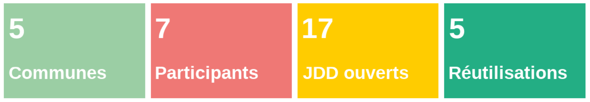

```{css, echo = FALSE}
#TOC ul>li {
  color: white;
  background-color: #23ae84;
  font-weight: normal; /*gras*/
  padding: 8px; /*espace avant*/
  /*margin-top: 1px; /*espace avant*/
}
#TOC {
  max-width: fit-content;
  white-space: nowrap;
  font-size: 1.3em; /*taille*/
  margin-left: -1%;
  z-index: 2; /*met la TOC au premier plan devant marginnote*/
  font-family: "Nexa Bold"; /*police*/
}
.sidenote, .marginnote { 
  float: left;
  clear: left;
  margin-left: -27%;
  margin-right: -40%;
  width: 57%;         # best between 50% and 60%
  margin-top: 0;
  margin-bottom: 0;
  font-size: 1.1rem;
  line-height: 1.3;
  vertical-align: baseline;
  position: relative;
  }
```

```{r logo et police, echo = FALSE, message = FALSE, warning=FALSE, error=FALSE}
# Logo BDM haut de page
htmltools::img(src = "https://nextcloud.datactivist.coop/s/kWMDDLHBXHXXgSE/preview", 
               alt = 'logo', 
               style = 'position:absolute; top:0; left:0; right:0;')

# Polices Nexa et Trade Gothic
#library(showtext)
#font_add("Nexa", regular = "Nexa Bold.otf")
#font_add("Trade Gothic", regular = "Trade Gothic.otf")
#showtext_auto()
```


<div class="sidenote">{width=200px}</div>


## Introduction

Territoires pionniers en France de l’open data, Bordeaux Métropole et la ville de Bordeaux œuvrent activement depuis le début des années 2010 à l’ouverture et la réutilisation des données publiques dont elles ont la responsabilité. 
Dès 2011, la Communauté Urbaine de Bordeaux et la ville de Bordeaux inaugurent les premiers portails de données ouvertes du territoire. 
En 2019, les deux administrations font converger leurs outils et créent, avec l’aide de cinq communes métropolitaines pilotes (Bègles, Mérignac, Le Taillan-Médoc, Pessac et Talence), “[l’atelier open data](https://opendata.bordeaux-metropole.fr/pages/accueil/)” : une plateforme de données ouvertes mutualisée. 
La mise à disposition de la plateforme s’accompagne d’une offre de service open data opérée par la Direction Générale Numérique et Systèmes d’Information (DGNSI) commune à la Métropole et à la ville de Bordeaux. 
En janvier 2023, l’atelier open data compte plus de 360 jeux de données accessibles et a permis la création d’une dizaine d’applications et de services par l’administration ou des tiers réutilisateurs.

<div class="sidenote">{width=200px}</div>

## Constat

Bien que pouvant être considéré, à juste titre, comme une réussite et une des dynamiques exemplaires d’open data territoriales en France, l’atelier open data Bordelais souffre d’un mal trop bien connu des collectivités territoriales en charge d’une politique de données ouvertes sur un territoire. La production et l’ouverture de données ne repose que sur un nombre limités de producteurs. 

En l'espèce, les jeux de données de l’atelier open data sont publiés pour plus de 70% par la Métropole de Bordeaux et 25% par la Ville de Bordeaux. La ville de Talence (20 jeux de données) et la ville de Pessac (2 jeux de données) sont les deux seules autres collectivités productrices de données de la plateforme. 

Conscient de cette faiblesse, la Métropole de Bordeaux a souhaité redynamiser la démarche d’ouverture des données pour les communes de son territoire. Elle proposa à 14 communes (6 communes pilotes ayant déjà accès à l’atelier open data et 8 nouvelles communes membres du service commun DGNSI) de participer à un challenge data d’avril à juin 2023. 

Sur les 14 communes, 5 communes ont accepté de relever le défi et d’être accompagnées par la DGNSI et Datactivist dans l’ouverture et la valorisation de leurs jeux de données : la ville de Bordeaux, Talence, Mérignac, Le Taillan-Médoc et le Haillan. 

<div class="sidenote">{width=200px}</div>

## Objectif

D’une durée de 3 mois et composé de 5 ateliers (cf. méthode), le challenge data poursuit 3 principaux objectifs : 

<font color='#e73458'>

* Acculturer et former les référents open data des communes par la pratique

</font>

Le challenge data vise à transmettre les piliers d’une culture générale de la donnée par la pratique. Afin d’éviter les écueils d’une approche descendante et peu motivante, les participants manipulent les données de leurs collectivités tout au long du challenge. 

<font color='#e73458'>


* Relancer la dynamique d’ouverture au sein des communes pilotes

</font>

Plus qu’une simple formation, le challenge data permet aux participants de découvrir un nouveau cadre méthodologique de publication de données. Les référents open data collaborent de l’identification à la valorisation des données dans un cadre ludique propice à une nouvelle forme d’engouement pour l’open data. Suite au challenge, ils pourront librement réutiliser cette méthode pour travailler sur de nouvelles données. 


<font color='#e73458'>


* Impulser un écosystème public de la donnée sur le territoire métropolitain

</font>

Les résultats du Challenge sont très concrets : jeux de données publiés et datavisualisations disponibles sous forme de graphiques ou de cartes. Les bénéfices de l’open data sont visibles et les communes participantes convaincues par l’utilité et la faisabilité de l’ouverture.

<div class="sidenote">{width=200px}</div>


## Méthode

Le Challenge est composé par 5 ateliers introduits par un webinaire de présentation. Lors de chaque atelier, les animateurs présentent une partie théorique courte pour comprendre les principes de base de l’open data mais aussi et surtout une partie pratique durant laquelle les participants font eux-mêmes. 


### {width=38px} Étape 1 : Diagnostic et identification des données


#### {width=25px} Principe

A partir d’un catalogue de données, les participants choisissent les données qu’ils souhaitent ouvrir pour réaliser leur wishlist, c'est-à-dire, leur liste au Père Noël. Forts de cette liste, ils partent ensuite à la recherche des données au sein de leur collectivité. Puis, chaque jeu de données collecté est étudié au travers d’une checklist pour évaluer le travail de mise en qualité nécessaire. Cela permet d’évaluer la faisabilité du travail à fournir, de hiérarchiser et de prioriser les efforts. A la fin de l’atelier, les participants définissent leur “Wanted data list”, c’est-à-dire, la liste des jeux de données qu’ils s’engagent à ouvrir. 


#### {width=25px} Supports

[Le catalogue de données](https://airtable.com/appt5LkiFMoP8alQl/shrBV8QWVZXTBg7Mz)

[Le support du webinaire de présentation](https://nextcloud.datactivist.coop/s/icCr8BJ7AYaJBk2)

[Le support de l’atelier 1](https://nextcloud.datactivist.coop/s/bEJy9iWEaGqWPrf)

[Le canevas : Checklist de mise en qualité](https://nextcloud.datactivist.coop/s/xTaErMxEdnyXzkb)


#### {width=25px} Ce qui a fonctionné / Ce qui a moins fonctionné

<div class="row">
<div class="col-md-2">
{width=120%}
</div>
<div class="col-md-10">


Cet atelier permet de commencer en douceur. On compare des jeux de données, on se pose les premières questions de faisabilité. Les canevas permettent de rassurer et de rendre concret le travail à venir.
</div>
</div>

<br>

<div class="row">
<div class="col-md-2">
{width=120%}
</div>
<div class="col-md-10">


Une question a été posée proche de la fin de l’atelier pour savoir à quoi devait ressembler un jeu de données pour être publié. Nous avons montré les ressources de l’atelier suivant comprenant des schémas de données. La réponse a été instantanée : Ah, c’est juste ça !
Nous aurions pu ajouter à la présentation un avant/après sur la mise en qualité d’un jeu de données pour montrer que cela est très accessible.
</div>
</div>


#### {width=25px} Conseil d’animation

Partir d’exemples réels adaptés au public que l’on a. Par exemple, si vous vous adressez à un service en particulier, l’idéal est de trouver des jeux de données qu’ils manipulent au quotidien.


#### {width=25px} Images/Visuels

Visuel ODC étape Identification

Wishlist // Checklist // Wanted data list


### {width=38px} Étape 2 : Mise en qualité 


#### {width=25px} Principe

L’étape de mise en qualité consiste à mettre en parallèle le jeu de données récupéré et un modèle de données. Les modèles, accompagnés de leur documentation, permettent une montée en qualité des données proposées en open data, surtout lorsque plusieurs producteurs de données produisent un même jeu de données. Ils peuvent être issus des schémas répertoriés sur [https://schema.data.gouv.fr](https://schema.data.gouv.fr) ou réalisés par les soins des animateurs à partir de jeux de données de qualité produits par d’autres collectivités (notamment la ville de Bordeaux).

Puisque chaque participant peut avoir un niveau différent sur l’utilisation d’Excel et que Bordeaux Métropole utilise la solution Open Data Soft pour son portail open data, il a été réalisé un tableau des différents traitements possibles avec des tutoriels pour chacun. Ainsi les participants ont nettoyé, compilé et standardisé leurs données. Cette étape est la moins glorifiante et souvent la plus longue, elle a donc pris 2 séances. C’est aussi le moment de questionnement de la saisie de la donnée au sein de son administration pour savoir si dorénavant, ces modifications devront être réalisées dès la phase de production ou si elles resteront à la charge du référent open data.


#### {width=25px} Supports

[Les modèles de données](https://nextcloud.datactivist.coop/s/iBTWDG4TGscd4SB)

[Le support de l’atelier 2](https://nextcloud.datactivist.coop/s/zcgYEq354HctKqY)

[Le support de l’atelier 3](https://nextcloud.datactivist.coop/s/kADqSF6WB765MGz)

La liste des tutoriels


#### {width=25px} Ce qui a fonctionné / Ce qui a moins fonctionné

<span style="text-decoration:underline;">Fonctionné</span>

La documentation des modèles de données a permis aux participants de comprendre l’aboutissement prévu du nettoyage. Lors de la seconde séance, les participants se sont dit “à l’aise” avec la méthode. Avec la pratique, la méthode et même la comparaison avec d’autres jeux de données produits par d’autres étaient acquises.

<span style="text-decoration:underline;">Moins fonctionné</span>

Les tutoriels ont bien aidé mais le template était prévu pour documenter au fur et à mesure les modifications apportées au jeu de données brut et décidé par écrit quand cette modification devait être réalisée (par le producteur de la donnée ou par le référent). Or, ce template n’a pas souvent été complété. Pour ne pas freiner le nettoyage et l’excellent volonté des participants, le format pourrait être adapté : 


1. On nettoie avec les tutoriels en support si besoin
2. On valide que le jeu de données est prêt
3. On documente uniquement à la fin les modifications et la suite à donner


#### {width=25px} Conseil d’animation

Faire quelques démonstrations simples qui font gagner beaucoup de temps pour donner envie de regarder les tutoriels sinon les participants ont tendance à garder leurs habitudes et pour la plupart font à la main.

Ne pas préjuger du niveau des participants et ne pas oublier d’expliquer les manipulations les plus simples. Par exemple : 


* Copier / Coller les valeurs brutes
* Recherche/Remplacer
* Convertir


#### {width=25px} Images/Visuels

JDD brut vers modèle avec explication


### {width=38px} Étape 3 : Publication


#### {width=25px} Principe

Cette étape est au cœur du challenge : la publication des jeux de données sur l’atelier open data métropolitain permet de travailler sur les enjeux liés à la publication des données afin d’en faciliter la découvrabilité et l’usage à travers le renseignement précis des métadonnées et de la licence.


#### {width=25px} Supports

[Le support de l’atelier 4](https://nextcloud.datactivist.coop/s/mo3RfL3gSL6THNx)

La liste des tutoriels


#### {width=25px} Ce qui a fonctionné / Ce qui a moins fonctionné

<span style="text-decoration:underline;">Fonctionné</span>

<span style="text-decoration:underline;">Moins fonctionné</span>

Bla

#### {width=25px} Conseil d’animation

Bla


#### {width=25px} Images/Visuels

Datasheets for datasets

Bouton sécurité


### {width=38px} Étape 4 : Valorisation des données


#### {width=25px} Principe

Parce que le travail d’une collectivité locale ne doit pas s’arrêter à la publication, le challenge propose une étape de valorisation des données. Après une partie théorique rapide des bases de la datavisualisation, les participants réalisent une dataviz imposée pour comprendre l’outil Open Data Soft et ses subtilités. Puis, la partie la plus créative arrive. C’est l’heure de se poser les questions sur ce que l’on souhaite représenter et dessiner à la main sa datavisualisation. L’atelier met en exergue que la dataviz ne se restreint pas à l’outil utilisé mais bien au message que l’on veut faire passer. Enfin, bien entendu, les participants réalisent, sur Open Data Soft, la datavisualisation imaginée.

Cette étape permet de se rendre compte de la qualité de ses données. Quoi de mieux qu’une carte pour visualiser qu’une école est mal placée donc que les coordonnées géographiques sont erronées. Cette étape de valorisation permet donc de se mettre à la place du réutilisateur et de comprendre les potentiels cas d’usage liés à ses données.


#### {width=25px} Supports

[Le support de l’atelier 5](https://nextcloud.datactivist.coop/s/MPCdAM6FZHeNkRD)

[Le canevas pour dessiner sa datavisualisation](https://nextcloud.datactivist.coop/s/SwkgZdw5ewkwdic)


#### {width=25px} Ce qui a fonctionné / Ce qui a moins fonctionné

<span style="text-decoration:underline;">Fonctionné</span>

Le dessin des dataviz, les âmes d’artistes ont pu se révéler !

<span style="text-decoration:underline;">Moins fonctionné</span>

Cette étape est la plus appréciée et tout le monde repart avec le sourire et le sentiment d’avoir produit quelque chose d’utile. Mais lorsqu’on se rend compte que ses données comportent des erreurs et nécessitent un retraitement, il semblerait utile d’avoir une session supplémentaire pour boucler le processus. De plus, le temps consacré à la réalisation des datavisualisations passe très vite, une seconde session pourrait permettre d’aborder d’autres outils.


#### {width=25px} Conseil d’animation

Pour la visualisation imposée, intégrer un “piège” sur les [facettes](https://userguide.opendatasoft.com/l/fr/article/ssrgpuc0y6-defining-a-dataset-schema#setting_up_fields_as_facets) du jeu de données. Cela permet aux participants de comprendre en un instant l’intérêt de bien les sélectionner !

L’étape du dessin est particulièrement révélatrice des réflexions à avoir pour réaliser sa datavisualisation, il faut bien avoir le temps de réaliser cette partie avec présentation au groupe.


#### {width=25px} Images/Visuels

A t-on des photos des dessins ??? Moi non…

<div class="sidenote">{width=200px}</div>

## Résultats

```{r include=FALSE, eval=FALSE}
library(icons)
library(tidyverse)
# Table
df <- data.frame(
    x = c(2, 8.5, 15, 21.5),
    y = rep(6.5, 4),
    h = rep(4.25, 4),
    w = rep(6.25, 4),
    value = c(5, 7, 17, 5),
    info = c("Communes",
             "Participants",
             "Jeux de données \nouverts",
             "Réutilisations"),
    color = factor(1:4)
)

# Graphique
ggplot(df, aes(x, y, height = h, width = w, label = info)) +
    ## Create the tiles using the `color` column
    geom_tile(aes(fill = color)) +
    ## Add the numeric values as text in `value` column
    geom_text(color = "white", fontface = "bold", size = 16,
              aes(label = ifelse(value > 999, format(as.integer(value, 0), nsmall = 1, big.mark = "."), value), 
                  x = x - 1, y = y + 0.7), 
              hjust = 0) +
    ## Add the labels for each box stored in the `info` column
    geom_text(color = "white", fontface = "bold", size = 10,
              aes(label = info, x = x - 2.9, y = y - 1), hjust = 0) +
    coord_fixed() +
    #scale_fill_manual(type = "qual", palette = "Dark2") +
    scale_fill_manual(values = c("#9bcea4", "#ef7875", "#ffcc00", "#23ae84", "#fecf5d", "#21468d")) +
    ## Use `geom_text()` to add the icons by specifying the unicode symbol.
    theme_void() +
    guides(fill = FALSE)
```




Mettre un mot sur chaque dataviz + la dataviz en iframe (voir taille à privilégier) + lien vers l’Atelier Open Data


### {width=25px} Points d’eau potable 

Prenons le cas d’usage des points d’eau potable dans une ville. La donnée n’est pas sensible et son ouverture est utile aux citoyens : habitants comme touristes.

Dans le cadre du Challenge, les points d’eau potable de la ville de Mérignac ont été ouverts. Les voici, présentés sur une carte.

 

<iframe frameborder="0" width="800" height="600" src="https://opendata.bordeaux-metropole.fr/map/embed/points_deau_potable_merignac/?&static=false&scrollWheelZoom=false"></iframe>

Le lien : [https://opendata.bordeaux-metropole.fr/map/points_deau_potable_merignac/](https://opendata.bordeaux-metropole.fr/map/points_deau_potable_merignac/)

   

Nous avons ajouté les contours des quartiers pour se retrouver plus facilement.

Si l’on recherche sur le portail, on remarque que deux autres villes ont publié leurs points d’eau potable, il semble donc intéressant de les ajouter à la datavisualisation.

<iframe frameborder="0" width="800" height="600" src="https://opendata.bordeaux-metropole.fr/map/embed/points_deau_merignac/?&static=false&scrollWheelZoom=false"></iframe>


Le lien : [https://opendata.bordeaux-metropole.fr/map/points_deau_merignac/](https://opendata.bordeaux-metropole.fr/map/points_deau_merignac/) 


#### {width=25px} Pour aller plus loin

Certaines collectivités ont recensé les points d’eau potable mais aussi tous les équipements et espaces pour se rafraîchir lors de canicules : 

([https://atlas-sig.seineouest.fr/portal/apps/webappviewer/index.html?id=27e3bb4febb448db836039f995f3d067](https://atlas-sig.seineouest.fr/portal/apps/webappviewer/index.html?id=27e3bb4febb448db836039f995f3d067)) 


### {width=25px} Effectifs scolaires

La ville du Haillan a publié les effectifs scolaires depuis l’année scolaire 1994/1995. Cela permet de visualiser l’évolution des effectifs de cette date à aujourd’hui. Nous avons comparé cette évolution à celle du nombre de classes.

<iframe src="https://opendata.bordeaux-metropole.fr/explore/embed/dataset/leh_effectifs_scolaires/analyze/?disjunctive.annee_scolaire&dataChart=eyJxdWVyaWVzIjpbeyJjaGFydHMiOlt7InR5cGUiOiJsaW5lIiwiZnVuYyI6IlNVTSIsInlBeGlzIjoibm9tYnJlX3RvdGFsX2RfZWxldmVzIiwic2NpZW50aWZpY0Rpc3BsYXkiOnRydWUsImNvbG9yIjoiIzY2YzJhNSJ9LHsiYWxpZ25Nb250aCI6dHJ1ZSwidHlwZSI6ImxpbmUiLCJmdW5jIjoiU1VNIiwieUF4aXMiOiJub21icmVfZGVfY2xhc3NlIiwic2NpZW50aWZpY0Rpc3BsYXkiOnRydWUsImNvbG9yIjoiI2ZjOGQ2MiJ9XSwieEF4aXMiOiJhbm5lZV9zY29sYWlyZSIsIm1heHBvaW50cyI6NTAsInNvcnQiOiIiLCJjb25maWciOnsiZGF0YXNldCI6ImxlaF9lZmZlY3RpZnNfc2NvbGFpcmVzIiwib3B0aW9ucyI6eyJkaXNqdW5jdGl2ZS5hbm5lZV9zY29sYWlyZSI6dHJ1ZX19fV0sInRpbWVzY2FsZSI6IiIsImRpc3BsYXlMZWdlbmQiOnRydWUsImFsaWduTW9udGgiOnRydWV9&static=false&datasetcard=false" width="800" height="600" frameborder="0"></iframe>

On remarque facilement que le nombre d’élèves commence à diminuer pour un nombre de classe stable. Si la collectivité se posait la question de l’intérêt de construire ou non un nouveau groupe scolaire, ces éléments peuvent contribuer à la réponse.

La ville de Mérignac a aussi publié les effectifs scolaires. On remarque que les données sont différentes. En effet, la ville de Mérignac s’est concentrée sur le millésime 2023. Dans les années à venir, il sera intéressant de suivre la mise à jour de ce jeu de données pour pouvoir suivre les effectifs dans le temps.

D’autre part, à partir de ces jeux de données, il est possible de réaliser une carte pour situer les écoles et ceci pour les deux jeux publiés. Cela pourra être intéressant à l’avenir de publier la sectorisation scolaire pour visualiser en un coup d'œil l’école dont on dépend.

<iframe frameborder="0" width="800" height="600" src="https://opendata.bordeaux-metropole.fr/map/embed/carte_ecole_la_haillan_merignac/?&static=false&scrollWheelZoom=false"></iframe>

Lien : https://opendata.bordeaux-metropole.fr/map/carte_ecole_la_haillan_merignac/


### {width=25px} Liste des associations

Seul jeu ouvert par Talence pour le moment

Aucune catégorisation, donc il n’est possible que de faire une carte

Proposition de catégorisation : [https://www.data.gouv.fr/ods/preview/data.angers.fr/annuaire_asso_angers](https://www.data.gouv.fr/ods/preview/data.angers.fr/annuaire_asso_angers)

Et cas d’usage : [https://issy.assolib.fr](https://issy.assolib.fr) 


### {width=25px} Réservation des salles municipales

[https://opendata.bordeaux-metropole.fr/explore/dataset/bor_reservations_salles_municipales_donnees/custom/](https://opendata.bordeaux-metropole.fr/explore/dataset/bor_reservations_salles_municipales_donnees/custom/) 


### {width=25px} Délibérations

Seul jeu ouvert par le Taillan Médoc

Partie ouverture/conclusive des résultants : Ce qu’ont retenu les participants

<div class="sidenote">{width=200px}</div>


## Et après

Guillaume

Perspectives suite au challenge (Enseignements - Recommandations / Leviers d'actions)

::: {.tocify-extend-page data-unique="tocify-extend-page" style="height: 0;"}
:::
